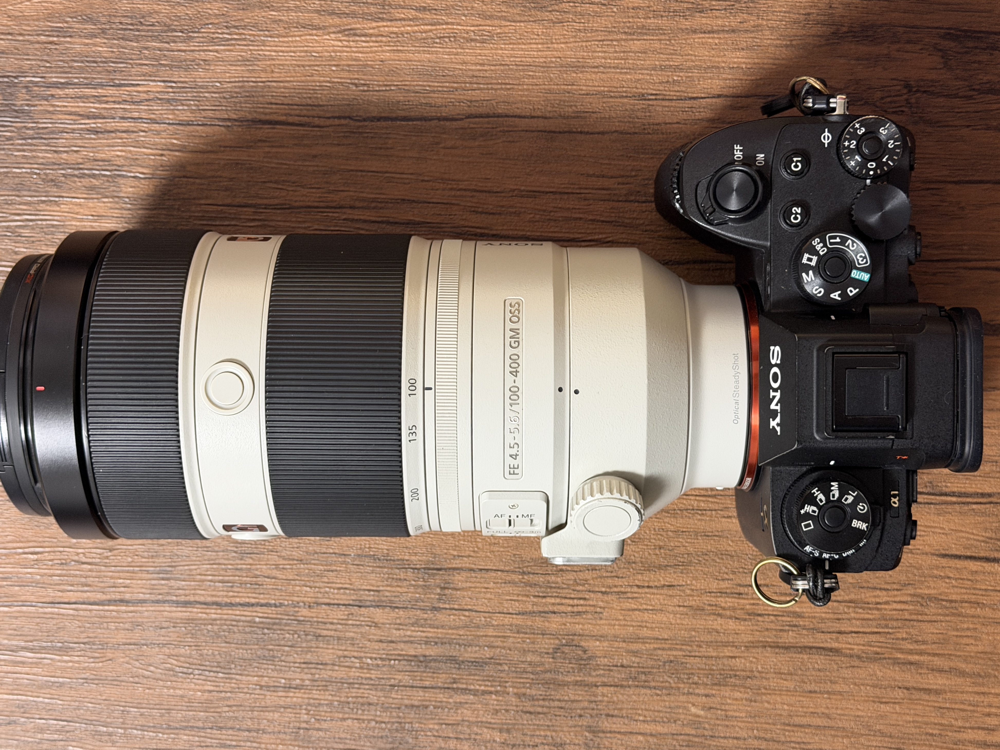

# Sony α1 操作説明書 — プロジェクト引き継ぎガイド

## リポジトリ
https://github.com/moiM01/camera_settings

## プロジェクト概要
Sony α1 および SEL100400GM レンズの個人用操作マニュアルサイト。
GitHub Pages で公開する静的 HTML サイト。

## ファイル構成

```
/
├── CLAUDE.md           ← このファイル（引き継ぎ用）
├── index.html          ← トップページ（目次カード）
├── style.css           ← 全ページ共通スタイル（ライトモード）
├── 01-button.html      ← Chapter 1: カメラ-ボタン割当
├── 02-lens.html        ← Chapter 2: レンズ-ボタン割当（SEL100400GM）
├── 03-settings.html    ← Chapter 3: 想定設定
├── 04-exposure.html    ← Chapter 4: カメラの3値について
└── image/              ← 画像ファイル置き場（IMG_XXXX.JPG）
```

## 技術スタック
- 純粋な HTML / CSS のみ（ビルドツール・フレームワークなし）
- GitHub Pages でそのまま公開可能

## デザイン仕様
- ライトモード（白背景、アクセントカラー: #1a6ed8）
- 左サイドバーナビゲーション（幅 260px、固定）
- 各ページ共通: `nav#sidebar` + `<main>` の2カラム構造
- 未記入セクションは `.placeholder` クラスの div で管理

## 各ページの記入状況
| ページ | 状況 |
|--------|------|
| 01-button.html | 記入済み（上面・背面ボタン・ダイヤル）|
| 02-lens.html | 未記入（プレースホルダーのみ）|
| 03-settings.html | 一部記入済み（想定設定）|
| 04-exposure.html | 記入済み（SS・F値・ISO・段数早見表）|

## Git セットアップ（別環境での作業開始手順）
```bash
# リポジトリをクローン
git clone https://github.com/moiM01/camera_settings.git
cd camera_settings

# ユーザー設定（初回のみ）
git config user.name "moiM01"
git config user.email "<your-email>"

# プッシュ時は Personal Access Token を使用
# GitHub → Settings → Developer settings → Personal access tokens
# でトークンを発行し、パスワード欄に入力する
```

## 画像の使い方
`image/` フォルダ直下の画像を HTML 内で参照する場合:
```html

```

## GitHub Pages URL
https://moiM01.github.io/camera_settings/
